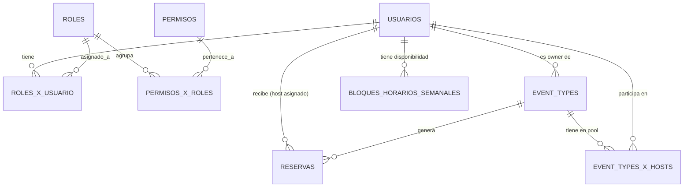

# Modelo de datos — Conquer Calendario

> **Fuente única de verdad** del esquema de la base de datos.

**Notación:**
- **ED** Entidad de Datos · **EC** Entidad de Catálogo · **EP** Entidad Pivote
- `(PK)` `(FK)` `(UQ)` `(NN)` `(IDX)`

---

## 1. Sistema de Autenticación y Usuarios

> App: `calendario.users`. Modelo: `User` (extiende `AbstractUser`).

### Entidades

#### `usuarios` (ED)

| Campo                  | Tipo Django                        | Restricciones                    | Notas                             |
|------------------------|------------------------------------|----------------------------------|-----------------------------------|
| `id`                   | BigAutoField (heredado)            | PK                               |                                   |
| `username`             | CharField(150) (heredado)          | UQ, NN                           | Autogenerado del email al importar |
| `email`                | EmailField (override)              | UQ, NN                           | Usado como login por allauth      |
| `password`             | CharField (heredado)               | NN                               | Hash argon2 — hosts usan `set_unusable_password()` |
| `first_name`           | CharField(150) (heredado)          | blank=True                       |                                   |
| `last_name`            | CharField(150) (heredado)          | blank=True                       |                                   |
| `slug`                 | SlugField(80)                      | UQ, NN                           | Autopoblado con `slugify(username)` |
| `avatar_url`           | URLField                           | blank=True                       |                                   |
| `timezone`             | CharField(64)                      | NN, default=`Europe/Madrid`      | IANA timezone string              |
| `is_active`            | BooleanField (heredado)            | NN, default=True                 |                                   |
| `date_joined`          | DateTimeField (heredado)           | auto_now_add                     |                                   |
| `fecha_actualizacion`  | DateTimeField                      | auto_now                         |                                   |

`db_table = 'usuarios'`

**`SLUGS_RESERVADOS`** = `{'accounts', 'admin', 'panel', 'health', 'r', 'reservas', 'static', 'media', 'api'}`. Validado en `User.save()`. Cualquier slug en esta lista lanza `ValidationError`.

#### `permisos` (EC)

| Campo                  | Tipo                   | Restricciones  |
|------------------------|------------------------|----------------|
| `permiso_id`           | BigAutoField           | PK             |
| `codename`             | CharField(100)         | UQ, NN         |
| `nombre`               | CharField(150)         | NN             |
| `descripcion`          | TextField              | blank=True     |
| `fecha_creacion`       | DateTimeField          | auto_now_add   |
| `fecha_actualizacion`  | DateTimeField          | auto_now       |

`db_table = 'permisos'` · Catálogo sembrado por migración.

**Permisos sembrados:**

| codename                    | Roles         |
|-----------------------------|---------------|
| `panel.acceder`             | admin, host   |
| `usuarios.ver/crear/editar/cambiar_password/activar/eliminar` | admin |
| `roles.ver/crear/editar/eliminar` | admin  |
| `permisos.ver`              | admin         |
| `event_types.ver/crear/editar/eliminar` | admin, host |
| `availability.ver/editar`   | admin, host   |
| `reservas.ver_propias`      | admin, host   |
| `reservas.cancelar`         | admin, host   |

#### `roles` (EC)

| Campo                  | Tipo                   | Restricciones  |
|------------------------|------------------------|----------------|
| `rol_id`               | BigAutoField           | PK             |
| `nombre`               | CharField(100)         | UQ, NN         |
| `descripcion`          | TextField              | blank=True     |
| `fecha_creacion`       | DateTimeField          | auto_now_add   |
| `fecha_actualizacion`  | DateTimeField          | auto_now       |

`db_table = 'roles'`

**Roles sembrados:** `admin` (20 permisos) · `host` (panel + event_types + availability + reservas, 10 permisos).

#### `roles_x_usuario` (EP)

| Campo            | Tipo                       | Restricciones                    |
|------------------|----------------------------|----------------------------------|
| `rxu_id`         | BigAutoField               | PK                               |
| `usuario_id`     | FK → `usuarios`            | NN, CASCADE                      |
| `rol_id`         | FK → `roles`               | NN, CASCADE                      |
| `fecha_creacion` | DateTimeField              | auto_now_add                     |

`db_table = 'roles_x_usuario'` · UQ compuesto `(usuario, rol)`.

#### `permisos_x_roles` (EP)

| Campo            | Tipo                       | Restricciones                    |
|------------------|----------------------------|----------------------------------|
| `pxr_id`         | BigAutoField               | PK                               |
| `rol_id`         | FK → `roles`               | NN, CASCADE                      |
| `permiso_id`     | FK → `permisos`            | NN, CASCADE                      |
| `fecha_creacion` | DateTimeField              | auto_now_add                     |

`db_table = 'permisos_x_roles'` · UQ compuesto `(rol, permiso)`.

---

## 2. Tipos de Evento y Disponibilidad

> Apps: `calendario.event_types` (modelo `EventType`) y `calendario.availability` (modelo `BloqueHorarioSemanal`).

#### `event_types` (ED)

`db_table = 'event_types'`

| Campo                    | Tipo Django                                             | Restricciones                                      |
|--------------------------|---------------------------------------------------------|----------------------------------------------------|
| `id`                     | BigAutoField                                            | PK                                                 |
| `host`                   | FK → `usuarios`                                         | NN, CASCADE                                        |
| `nombre`                 | CharField(150)                                          | NN                                                 |
| `slug`                   | SlugField(120)                                          | NN, UQ por host                                    |
| `descripcion`            | TextField                                               | blank=True                                         |
| `duracion_minutos`       | PositiveSmallIntegerField                               | NN, 5–480                                          |
| `buffer_antes_minutos`   | PositiveSmallIntegerField                               | default 0                                          |
| `buffer_despues_minutos` | PositiveSmallIntegerField                               | default 0                                          |
| `aviso_minimo_horas`     | PositiveSmallIntegerField                               | default 0                                          |
| `precio`                 | DecimalField(10, 2)                                     | null=True, blank=True                              |
| `activo`                 | BooleanField                                            | default True                                       |
| `fecha_creacion`         | DateTimeField                                           | auto_now_add                                       |
| `fecha_actualizacion`    | DateTimeField                                           | auto_now                                           |

**Constraints:** UQ `(host, nombre)` · UQ `(host, slug)` · CHECK `precio >= 0`.

#### `bloques_horarios_semanales` (ED)

`db_table = 'bloques_horarios_semanales'`

| Campo                 | Tipo Django                          | Restricciones                                      |
|-----------------------|--------------------------------------|----------------------------------------------------|
| `id`                  | BigAutoField                         | PK                                                 |
| `host`                | FK → `usuarios`                      | NN, CASCADE                                        |
| `dia_semana`          | PositiveSmallIntegerField            | NN — 0=Lunes…6=Domingo                             |
| `hora_inicio`         | TimeField                            | NN — naive, interpretado en `host.timezone`        |
| `hora_fin`            | TimeField                            | NN                                                 |
| `fecha_creacion`      | DateTimeField                        | auto_now_add                                       |
| `fecha_actualizacion` | DateTimeField                        | auto_now                                           |

**Constraints:** UQ `(host, dia_semana, hora_inicio, hora_fin)` · CHECK `hora_fin > hora_inicio`.

---

## 3. Reservas

> App: `calendario.bookings`. Modelo: `Reserva`. `db_table = 'reservas'`.

#### `reservas` (ED)

| Campo                | Tipo                                              | Restricciones                                                               |
|----------------------|---------------------------------------------------|------------------------------------------------------------------------------|
| `id`                 | BigAutoField                                      | PK                                                                           |
| `event_type`         | FK → `event_types`                                | NN, PROTECT                                                                  |
| `host`               | FK → `usuarios`                                   | NN, CASCADE                                                                  |
| `inicio_utc`         | DateTimeField                                     | NN                                                                           |
| `fin_utc`            | DateTimeField                                     | NN — `inicio_utc + duracion_minutos`                                         |
| `nombre_invitado`    | CharField(150)                                    | NN                                                                           |
| `email_invitado`     | EmailField                                        | NN                                                                           |
| `notas`              | TextField                                         | blank=True                                                                   |
| `estado`             | CharField(20)                                     | NN, choices: `confirmada` / `cancelada`                                      |
| `confirmacion_token` | UUIDField                                         | UQ, auto, editable=False                                                     |
| `google_event_id`    | CharField(200)                                    | blank=True, db_index                                                         |
| `google_meet_url`    | URLField                                          | blank=True                                                                   |
| `google_sync_estado` | CharField(20)                                     | NN, choices: `pendiente` / `sincronizado` / `error`                          |
| `fecha_creacion`     | DateTimeField                                     | auto_now_add                                                                 |
| `fecha_actualizacion`| DateTimeField                                     | auto_now                                                                     |

**Constraints:** UQ `(host, inicio_utc) WHERE estado='confirmada'` · CHECK `fin_utc > inicio_utc`.

**Indexes:** `(host, estado, inicio_utc)` — query principal de slots y listado de panel.

---

## 4. Round-Robin

> App: `calendario.event_types`. Modelo: `EventTypeXHost`. `db_table = 'event_types_x_hosts'`.

#### `event_types_x_hosts` (EP)

| Campo            | Tipo                          | Restricciones                                                |
|------------------|-------------------------------|--------------------------------------------------------------|
| `id`             | BigAutoField                  | PK                                                           |
| `event_type`     | FK → `event_types`            | NN, CASCADE                                                  |
| `host`           | FK → `usuarios`               | NN, CASCADE                                                  |
| `fecha_creacion` | DateTimeField                 | auto_now_add                                                 |

**Constraints:** UQ `(event_type, host)`.

`EventType.host` = owner/creador (gestiona CRUD, mantiene slug URL). El pivot es la fuente de verdad del pool de round-robin.

---

## Diagrama Relacional

